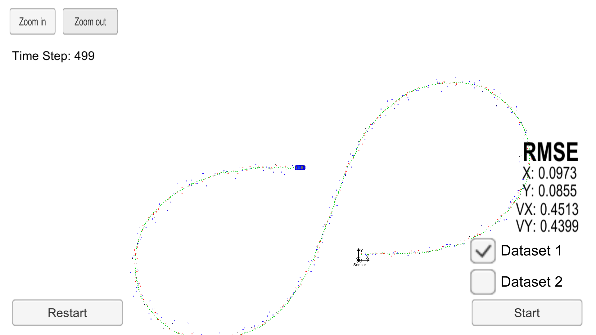

# Extended-Kalman-Filters


I ran my algorithm using the two provided datasets, the results are depicted below:

### Dataset 1: 
```
Accuracy - RMSE:
x: 0.0973178
y: 0.0854597
vx: 0.451267
vy: 0.439935
```




### Dataset 2: 
```
Accuracy - RMSE:
x: 0.0726207
y: 0.096663
vx: 0.457881
vy: 0.496596
```

